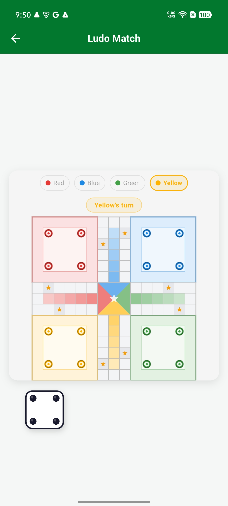

# flutter_ludo

A reusable, production-ready Ludo game engine and board widget for Flutter.

Board geometry, capture rules, and win conditions are **fixed** to the
standard, 4-player Ludo game — there's nothing to get wrong there. Dice
behaviour is **configurable**. A clean, controller-based architecture keeps
your app's state management free to do whatever it wants around it.


## ScreenShot
  

## Features

- Fixed 4-player, standard 15x15 Ludo board (52-cell shared path, 5-cell
  colored home stretches, 8 safe/star cells).
- Configurable dice rules: which values let a piece leave home, and which
  values grant an extra turn.
- A pure, stateless rules engine (`LudoEngine`) plus a `ChangeNotifier`
  controller (`LudoController`) that wraps it with events and a mutable
  game loop.
- Six events to hook into: dice rolled, piece moved, piece captured, turn
  changed, player won, game finished.
- A ready-to-use `LudoGame` widget (board + dice + status bar), or use
  `LudoBoard` / `LudoDice` standalone and build your own surrounding UI.
- Theming via `LudoTheme` for colors — board layout and rules are not
  themeable by design.
- Unit tests for the rules engine, validation, captures, and win
  conditions, plus controller and widget tests.

## Installation

This is delivered as a local package. Add it to your app's `pubspec.yaml`
with a path (or git) dependency:

```yaml
dependencies:
  flutter_ludo:
    path: ../flutter_ludo # adjust to wherever you place this folder
```

Then run `flutter pub get`.

To publish it to your own pub server or pub.dev later, remove the
`publish_to: none` line in `flutter_ludo/pubspec.yaml` and fill in the
`homepage` / `repository` fields.

## Quick start

```dart
import 'package:flutter/material.dart';
import 'package:flutter_ludo/flutter_ludo.dart';

final controller = LudoController(
  players: const [
    LudoPlayer(name: 'Red', color: Colors.red),
    LudoPlayer(name: 'Green', color: Colors.green),
    LudoPlayer(name: 'Yellow', color: Colors.yellow),
    LudoPlayer(name: 'Blue', color: Colors.blue),
  ],
  diceRules: const LudoDiceRules(
    startAllowedValues: [6], // classic rule
    extraTurnValues: [6],
  ),
  onPlayerWon: (playerIndex, place) => print('Player $playerIndex: place $place'),
  onGameFinished: (winnersInOrder) => print('Final order: $winnersInOrder'),
);

// Anywhere in your widget tree:
LudoGame(controller: controller)
```

`LudoController` is a `ChangeNotifier` you own — create it in `initState`
(or your state-management layer of choice) and call `controller.dispose()`
when you're done with it.

## Driving the game manually

If you don't want the bundled `LudoGame` widget, drive everything yourself
with `LudoController`:

```dart
final value = controller.rollDice();           // returns 1-6
final moves = controller.state.legalMoves;      // what can be played
if (moves.isNotEmpty) {
  controller.selectPiece(moves.first.pieceId);   // performs the move
}
```

`controller.state` is an immutable `LudoGameState` exposing `players`,
`pieces`, `currentPlayerIndex`, `diceValue`, `legalMoves`, `winners`, and
`isFinished`.

### Events

```dart
LudoController(
  players: players,
  onDiceRolled: (value) {},
  onPieceMoved: (piece, fromPosition, toPosition) {},
  onPieceCaptured: (capturedPiece, byPiece) {},
  onTurnChanged: (currentPlayerIndex) {},
  onPlayerWon: (playerIndex, place) {},       // place is 1-based
  onGameFinished: (winnersInOrder) {},        // full final ranking
)
```

### Testing without real randomness

`LudoController` accepts a `diceRoller` override, so tests (and replayable
demos) don't need to depend on real randomness:

```dart
final rolls = [6, 4, 6];
var i = 0;
final controller = LudoController(
  players: players,
  diceRoller: () => rolls[i++],
);
```

## Rules reference

- **Players:** exactly 4, fixed.
- **Board:** standard 15x15 cross-shaped board; 52-cell shared path; each
  player has a 5-cell colored home stretch; 8 safe cells (each player's
  start cell, plus one star cell per arm) where pieces can't be captured.
- **Starting a piece:** only with a dice value in `diceRules.startAllowedValues`
  (default `[6]`).
- **Capturing:** landing exactly on an opponent's piece sends it back home,
  unless that cell is a safe cell or the opponent is in their own home
  stretch.
- **Finishing:** a piece needs an *exact* roll to land on the final cell —
  rolls that would overshoot are simply not offered as legal moves.
- **Winning:** a player wins once all 4 of their pieces are finished.
- **Game end:** once 3 of the 4 players have won, the game ends and the
  4th (remaining) player is automatically placed last — the standard Ludo
  convention.
- **Extra turns:** rolling a value in `diceRules.extraTurnValues` (default
  `[6]`) lets the same player go again, *as long as* that roll produced a
  legal move; a roll with no legal moves always passes the turn.

## Package structure

```
lib/
  constants/   fixed board geometry (grid, path, safe cells, home stretches)
  service/     AudioService
  models/      LudoPlayer, LudoPiece, LudoDiceRules, LudoLegalMove, LudoGameState
  rules/       move validation, capture rules, win conditions (pure functions)
  engine/      LudoEngine — the pure, stateless turn-flow engine
  controller/  LudoController — ChangeNotifier wrapper with events
  themes/      LudoTheme
  widgets/     LudoGame, LudoBoard, LudoDice
test/          mirrors the structure above
example/       a runnable demo app
```

## Running tests

```
flutter test
```

## Roadmap / out of scope for v1.0

- Configurable player counts (2/3-player variants).
- Blockades (stacking two of your own pieces to block a cell).
- Animated dice roll / piece movement beyond the simple position fade.
- Networked/multiplayer transport — `LudoController` is purely local
  state; wire its events into your own networking layer if needed.

## Versioning

This package follows semantic versioning. See `CHANGELOG.md` for release
notes.